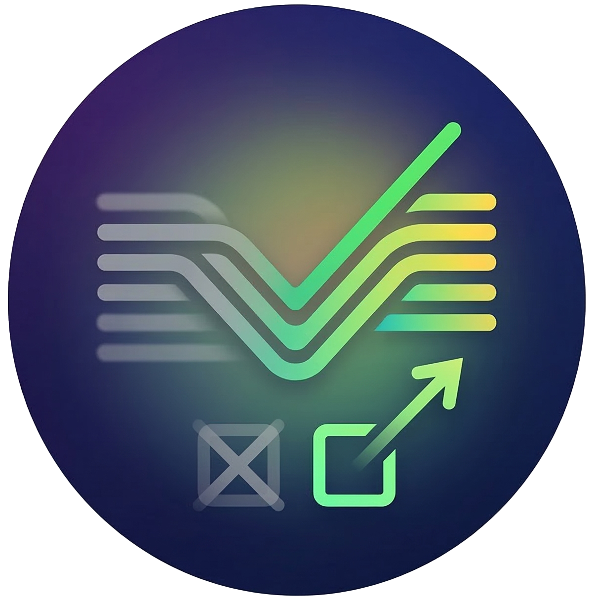

<p align="center">
  
</p>

<h1 align="center">🕯️ 临终清单</h1>

<p align="center">
  <strong>别等死了才后悔</strong>
</p>

<p align="center">
  收集真实的临终遗憾，在你还来得及的时候行动。
</p>

<p align="center">
  
  
  
  
  
</p>

---

## 💭 这是什么？

> *后悔没有多陪陪父母，总觉得来日方长，却不知道时间从不等人。*
>
> *后悔没有对那个人说出口，怕被拒绝的恐惧远不如一辈子的"如果当初"痛苦。*
>
> *后悔活在别人的期待里，从来没问过自己真正想要什么。*

**临终清单** 是一个匿名遗憾数据库 App。我们收集来自真实临终访谈、书籍和用户投稿的人生遗憾，让你看一眼别人的遗憾清单，然后问你：

**你现在可以做哪条？**

看到触动你的遗憾 → 点「我也是」共鸣 → 加入你的行动清单 → 现在就去做。

**别让遗憾成为你的结局。**

---

## 📱 功能特性

| 页面 | 功能 | 亮点 |
|------|------|------|
| 🏠 **首页** | 每日一条遗憾 + 数据概览 | 烛光启动动画、Shimmer 骨架屏 |
| 📜 **遗憾广场** | 浏览所有遗憾，按分类筛选 | 下拉刷新、实时同步、触觉反馈 |
| ✏️ **发布遗憾** | 完全匿名提交 | 敏感词过滤、字数限制、云端/本地状态反馈 |
| ✅ **待办清单** | 「别等死了才后悔」行动清单 | 打卡记录、删除确认、完成统计 |
| 📊 **数据洞察** | Top 共鸣排行 + 分类分布 | 可视化进度条、排行榜 |

### ✨ 体验细节

- 🕯️ **烛光启动页** — 呼吸动画 + 渐入文字，仪式感拉满
- ❤️ **共鸣防刷** — 空心♡ → 实心❤️，状态持久化到 DataStore
- 📶 **离线横幅** — 实时检测网络，断网自动提示 + 本地回退
- 💀 **骨架屏** — 加载时展示 Shimmer 卡片占位，告别转圈
- 📳 **触觉反馈** — 点亮红心时手机微震，增强仪式感
- 🛡️ **内容审核** — 广告/敏感词过滤，附心理援助热线

---

## 🛠️ 技术栈

| 层级 | 技术 |
|------|------|
| **UI** | Jetpack Compose + Material3 |
| **架构** | MVVM + 单向数据流 |
| **本地存储** | Room + DataStore |
| **云端** | Firebase Firestore（实时监听） |
| **异步** | Kotlin Coroutines + Flow |
| **语言** | Kotlin 2.1 |
| **最低版本** | Android 8.0 (API 26) |

---

## 🏗️ 架构

```
┌─────────────────────────────────────────────────┐
│                    UI Layer                      │
│  Screen (Compose) ← UiState ← ViewModel         │
├─────────────────────────────────────────────────┤
│                  Domain Layer                    │
│            RegretRepository                      │
│            TodoRepository                        │
├──────────────────┬──────────────────────────────┤
│   Local (Room)   │   Remote (Firestore)          │
│   ResonateStore  │   FirestoreDataSource         │
│   ContentFilter  │   实时监听 + 超时回退           │
└──────────────────┴──────────────────────────────┘
```

**数据策略：**
- **读取**：优先 Firestore 实时数据 → 失败回退 Room 本地缓存
- **写入**：双写 Firestore + Room，确保离线可用
- **共鸣**：Firestore `FieldValue.increment` 原子操作，全局计数一致

---

## 📁 项目结构

```
app/src/main/java/com/lastregrets/
├── data/
│   ├── model/          # Regret, TodoItem, RegretCategory
│   ├── local/          # Room DB, DAO, SeedData, ResonateStore, ContentFilter
│   ├── remote/         # FirestoreDataSource
│   └── repository/     # RegretRepository, TodoRepository
├── ui/
│   ├── theme/          # 暗色主题 (Color, Theme, Type)
│   ├── screens/        # SplashScreen + 5 个业务页面
│   ├── viewmodel/      # 5 个 ViewModel
│   ├── navigation/     # Bottom Nav + NavHost
│   └── components/     # ShimmerEffect, OfflineBanner, CommonComponents
├── MainActivity.kt
└── LastRegretsApp.kt
```

---

## 🚀 快速开始

### 1. 克隆项目
```bash
git clone https://github.com/Ryan00956/before-i-die.git
```

### 2. 配置 Firebase（可选）
参照 [FIREBASE_SETUP.md](FIREBASE_SETUP.md) 配置。**不配置也能运行**，App 会自动使用本地数据。

### 3. 构建运行
用 Android Studio 打开项目 → Sync Gradle → Run。

---

## 🎨 设计理念

| 元素 | 选择 | 原因 |
|------|------|------|
| **暗色主题** | `DeepNavy` #0D1B2A | 营造沉思、内省的氛围 |
| **主色调** | `WarmAmber` #FFB347 | 烛光般的温暖，照亮遗憾 |
| **强制暗色** | 不跟随系统 | 项目调性需要始终保持深沉 |
| **匿名设计** | 无登录、无头像 | 降低分享门槛，保护用户隐私 |
| **8 种分类色** | 亲情蓝、爱情红、梦想金… | 直觉识别不同类型的遗憾 |

---

## 📊 种子数据

内置 **44 条**来自真实临终访谈、书籍（《临终前最后悔的五件事》等）的遗憾，覆盖 8 个分类：

| 分类 | 数量 | 示例 |
|------|------|------|
| 👨‍👩‍👧‍👦 亲情 | 8 | *后悔没有多陪陪父母* |
| ❤️ 爱情 | 6 | *后悔没有对那个人说出口* |
| 💼 事业 | 5 | *后悔一辈子都在做不喜欢的工作* |
| 🏃 健康 | 5 | *后悔年轻时不注意身体* |
| 🌟 梦想 | 6 | *后悔没有去看看这个世界* |
| 🤝 友情 | 4 | *后悔弄丢了最好的朋友* |
| 🌱 自我 | 6 | *后悔活在别人的期待里* |
| 💭 其他 | 4 | *后悔攒了一辈子钱却没享受过* |

---

## 📄 License

[MIT](LICENSE) — 自由使用，但请别等死了才后悔没早点 star ⭐
